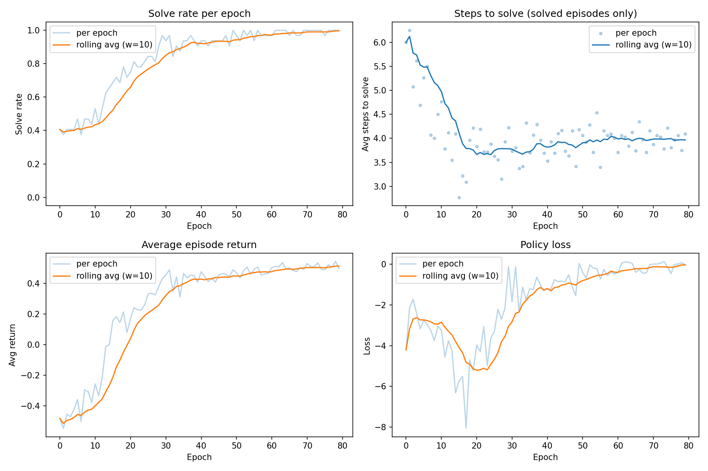

# RL-Lean

Reinforcement learning for automated Lean 4 theorem proving with **curriculum learning**. A policy network learns to select proof tactics by interacting with the Lean prover through [PyPantograph](https://github.com/stanford-centaur/PyPantograph), using the REINFORCE algorithm. Theorems the agent proves are fed back as usable lemmas, so it can build up a library of results and reach goals it could not prove from scratch.

## How it works

An **oracle tactic** (implemented on the Lean side) enumerates candidate proof steps for a given goal state. The RL agent learns to pick the right tactic at each step to close the proof. The training loop:

1. Walks the theorems of a Lean file **in source order** (simple → complex), wrapping across epochs
2. Queries the oracle for available moves at each proof state — including `apply`/`rw` of theorems **already proved earlier in this run**
3. Uses a policy network to select a move
4. Receives reward (+1 for closing the proof, -0.1 per step, -1 for dead ends)
5. Updates the policy with REINFORCE + a running baseline
6. Records each solved theorem so it becomes an available lemma for later, harder goals



### Curriculum learning

The training script keeps a `proved` set of theorems the agent has closed so far. Before each episode, every proved theorem (except the current goal, to prevent trivially closing it with `exact <itself>`) is offered to the oracle as both an `apply <thm>` and a forward `rw [<thm>]` move. Easy theorems fall first and become lemmas; harder theorems that depend on them then become reachable.

This is exercised by `LeanStuff/Curriculum.lean` in the Lean repo, an ordered Peano-arithmetic curriculum culminating in commutativity of addition:

```
add_zero : n + 0 = n                  -- definitional (`constructor`)
add_succ : n + succ m = succ (n + m)  -- definitional (`constructor`)
zero_add : 0 + n = n                  -- induction
succ_add : succ m + n = succ (m + n)  -- induction
add_comm : m + n = n + m              -- CAPSTONE: rewrites all four lemmas + the IH
```

`add_comm` is *unreachable* with the primitive tactics alone — its inductive step must rewrite subterms — so the agent can only solve it by composing the lemmas it proved earlier. The run logs the climb:

```
+ first proof of Peano.add_zero (proved set now: 1)
+ first proof of Peano.add_succ (proved set now: 2)
+ first proof of Peano.zero_add (proved set now: 3)
+ first proof of Peano.succ_add (proved set now: 4)
+ first proof of Peano.add_comm (proved set now: 5)
>> SOLVED Peano.add_comm using lemma(s): ['rw [Peano.succ_add]', 'rw [Peano.add_zero]', 'rw [Peano.zero_add]', 'rw [Peano.add_succ]']
```

## Project structure

| File | Description |
|---|---|
| `REINFORCE.py` | Training script — config, training loop, entry point |
| `lean_env.py` | Lean prover interface — `OracleTactic`, `get_theorems`, `get_moves`, `step` |
| `policy.py` | Neural network — `SimpleEncoder` (bag-of-embeddings) and `PolicyNetwork` (state-action scorer) |
| `tokenizer.py` | Text processing — `tokenize`, `Vocab`, `encode_text` |
| `plotting.py` | Training curve visualization |

### Key definitions

**`OracleTactic`** (`lean_env.py`) — Wraps the Lean-side `so` tactic. Configured with tactic groups:
- `close`: tactics that close a goal (e.g. `constructor`)
- `hyp`: tactics that operate on hypotheses (e.g. `induct_rename`, `apply`, `cases`)
- `var`: tactics that introduce variables (e.g. `intro`)
- `func`: function/constructor names to try (e.g. `Nat.succ`)
- `apply`: previously-proved theorems to try as `apply <thm>` / `exact <thm>` (filled in dynamically each episode)
- `rw`: previously-proved theorems to try as forward `rw [<thm>]`; also offers `rw [<hyp>]` (e.g. the induction hypothesis). Set to `[]` to enable the feature, `None` to disable it

The oracle only returns moves that actually apply to the current goal — it tries each candidate and keeps the ones that succeed.

**`get_theorems`** (`lean_env.py`) — Traces the Lean repository and returns its theorems, optionally filtered to a single `file_path` and sorted by source position (so the curriculum is walked simple → complex).

**`get_moves`** (`lean_env.py`) — Sends the oracle tactic to the Lean server and parses the suggested next moves from the response messages.

**`step`** (`lean_env.py`) — Applies a tactic string to the current proof state via Pantograph and returns `(new_state, reward, done)`.

**`PolicyNetwork`** (`policy.py`) — Scores each candidate action given the current goal state. Encodes both the goal and each action as bag-of-embeddings vectors, concatenates them, and passes through an MLP to produce a scalar score. Scores are softmaxed to get a distribution over actions.

**`Vocab`** (`tokenizer.py`) — Builds a token-to-id mapping on the fly. Special tokens: `<PAD>`, `<UNK>`, `<HYP>` (hypothesis names are normalized to `<HYP>`).

## Setup

### 1. Clone the Lean repository

```bash
git clone https://github.com/nelsmartin/lean-stuff
cd lean-stuff
lake build
```

### 2. Install Python dependencies

Requires Python 3.13. Using [uv](https://docs.astral.sh/uv/):

```bash
cd /path/to/RL-Lean
uv sync
```

### 3. Configure and run

In `REINFORCE.py`, point `REPO_URL` at your local clone of `lean-stuff`, and make sure `COMMIT` / `FILE_PATH` select the theorem file you want to train on (defaults to the `Curriculum.lean` curriculum):

```python
REPO_URL  = "/path/to/your/lean-stuff"
COMMIT    = "..."                       # a commit of lean-stuff to trace
FILE_PATH = "LeanStuff/Curriculum.lean" # which file's theorems to use
```

Then run:

```bash
uv run python REINFORCE.py
```

`NUM_EPOCHS` and `BATCH_SIZE` can be overridden via environment variables for quick experiments, e.g.:

```bash
NUM_EPOCHS=40 uv run python REINFORCE.py
```

The run prints per-epoch metrics plus a log of first proofs and lemma reuse (see above), and saves training curves to `training_curves.png` on completion.

> **Note:** the first run on a new `COMMIT` traces the repository (via `lean-dojo-v2`), which requires network access and is cached under `raid/data/`. Subsequent runs reuse the cache.

## Next steps

- **Alternative RL algorithms** — Support other policy gradient methods such as PPO or A2C, which may offer more stable training and better sample efficiency compared to vanilla REINFORCE.
- **Sound "proved" gating** — Currently a theorem counts as proved when the goal closes (reward `+1`); it is not checked to be `sorry`-free. Verify the closed proof's axioms before adding it to the lemma library.
- **Richer rewrites** — Reverse rewrites (`rw [← thm]`) and deeper curricula (e.g. multiplication: `mul_comm`, distributivity) to push the agent further.

## References

### Tools

- de Moura, L., & Ullrich, S. (2021). [The Lean 4 Theorem Prover and Programming Language](https://leanprover.github.io/papers/lean4.pdf). *CADE-28*.
- Yang, K., et al. (2023). [LeanDojo: Theorem Proving with Retrieval-Augmented Language Models](https://arxiv.org/abs/2306.15626). *NeurIPS 2023 (Datasets and Benchmarks)*.
- Aniva, L., et al. (2025). [Pantograph: A Machine-to-Machine Interaction Interface for Advanced Theorem Proving, High Level Reasoning, and Data Extraction in Lean 4](https://arxiv.org/abs/2410.16429). *TACAS 2025*.

### Theorem proving & curriculum learning

- Polu, S., et al. (2022). [Formal Mathematics Statement Curriculum Learning](https://arxiv.org/abs/2202.01344). *arXiv:2202.01344*.
- Polu, S., & Sutskever, I. (2020). [Generative Language Modeling for Automated Theorem Proving](https://arxiv.org/abs/2009.03393). *arXiv:2009.03393*.
- Lample, G., et al. (2022). [HyperTree Proof Search for Neural Theorem Proving](https://arxiv.org/abs/2205.11491). *NeurIPS 2022*.

### Reinforcement learning

- Williams, R.J. (1992). [Simple statistical gradient-following algorithms for connectionist reinforcement learning](https://link.springer.com/article/10.1007/BF00992696). *Machine Learning*, 8(3-4), 229-256.
- Sutton, R.S., & Barto, A.G. (2018). [Reinforcement Learning: An Introduction](http://incompleteideas.net/book/the-book-2nd.html) (2nd ed.). MIT Press.
- Bengio, Y., Louradour, J., Collobert, R., & Weston, J. (2009). [Curriculum Learning](https://dl.acm.org/doi/10.1145/1553374.1553380). *ICML 2009*.
